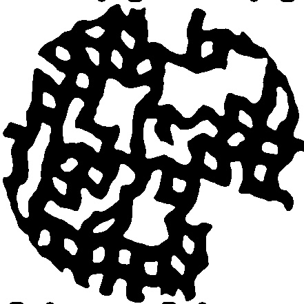

# MapDiscover

A multi-agent environment for the purpose of map discovery task.

## Current functionalities

- Load an image as the map (e.g. [map-blueprint.jpg](res/map-blueprint.jpg))
- Generates any number (`NUM_AGENTS` in [init.py](init.py)) of agents with a square field-of-view
- Agents do random walk
- Agents' FoVs can be saved to [snap](snap) folder as snapshot images (`Agent.snapshot(t)` where `t` is used for
labelling with the convention `agentID_TTT.jpg`)
- Can generate random connected paths over a square grid and then deform it with [map_manipulate.py](map_manipulate.py)

&nbsp;&nbsp;&nbsp;&nbsp;&nbsp;&nbsp;&nbsp;
&nbsp;&nbsp;&nbsp;&nbsp;&nbsp;&nbsp;&nbsp;

- A smoother deformation can be generated with [map_manipulation_smooth.py](map_manipulation_smooth.py)

&nbsp;&nbsp;&nbsp;&nbsp;&nbsp;&nbsp;&nbsp;
&nbsp;&nbsp;&nbsp;&nbsp;&nbsp;&nbsp;&nbsp;

### Notes:
- Agents' snapshots are saved with time, which is converted to three digits.
To save beyond 1000 snapshots, modify `zfill(3)` under `Agent::snap()` in [agent_definition.py](agent_definitions.py). 
- Experimenting on different parameters that are defined in [map_manipulate.py](map_manipulate.py) along
the distortion (convolution of sinusoidal waves), sharpening (kernel), and smoothing (Gaussian kernel) is recommended.
## Installation and usage

Install dependencies:
```python
pip install requirements.txt
```

Run the code:
```python
python main.py
```

Generate random maps:
```python
python map_manipulate.py
```
You need to uncomment the line `# generate()` to generate a new square grid layout.
The deformation is carried out in the following line with `deform()`.
To include the new map as the layout, [init.py](init.py) needs to be modified.
```python
BACKGROUND = pg.image.load("res/map-blueprint.jpg")
```

Example view of individual agents:


